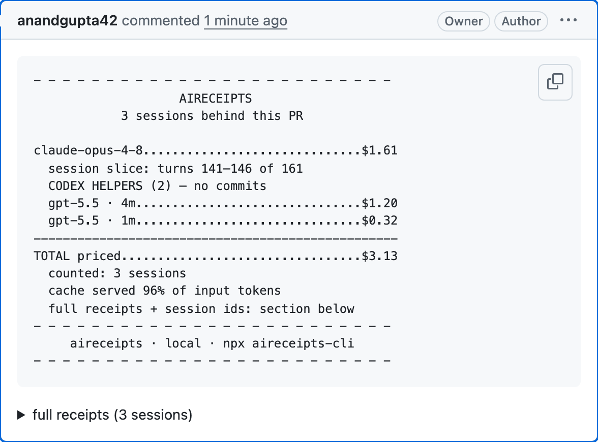
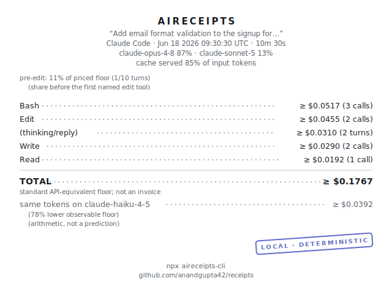
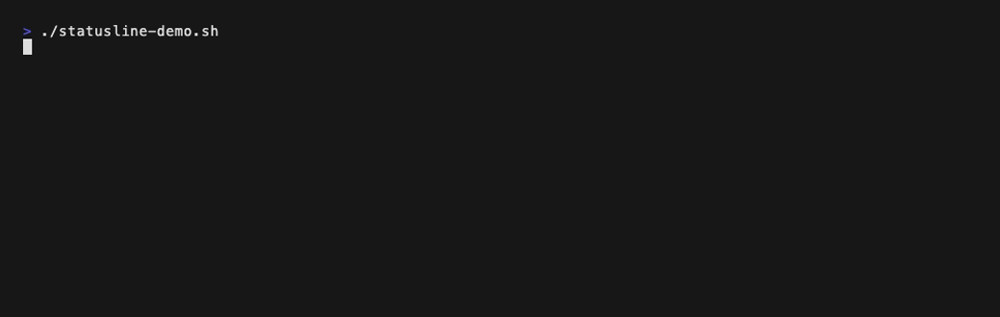

<div align="center">

<picture>
  <source media="(prefers-color-scheme: dark)" srcset="site/brand/wordmark-dark.svg">
  
</picture>

**Your AI coding agent just billed you. Here's the receipt.**

[](https://github.com/anandgupta42/receipts/actions/workflows/ci.yml) [](https://www.npmjs.com/package/aireceipts-cli) [](https://scorecard.dev/viewer/?uri=github.com/anandgupta42/receipts) [](LICENSE)

<a href="https://github.com/anandgupta42/receipts/pull/189#issuecomment-4921391222">
  
</a>

<sub>not a mockup — a receipt comment on a merged PR of this repo, posted by
<code>aireceipts pr --post</code>: three sessions — a Claude orchestrator sliced
to just this PR's turns, plus two Codex helpers — $3.13 total.
<a href="https://github.com/anandgupta42/receipts/pull/189#issuecomment-4921391222">Read it live.</a></sub>

</div>

**Why this exists.** AI coding agents spend real money invisibly — you see the diff,
never the bill. aireceipts reads the transcripts your agent already writes to disk and
turns them into receipts: what a session cost, tool by tool; what a PR cost, across
every session it can attribute; where tokens were wasted. It's local — your code, file
contents, and raw transcripts never leave your machine, and pricing needs no network. A
receipt is the one thing worth sharing, and sharing is always your call — a PR comment,
a git ref, or an artifact page. A shared receipt carries cost, token, model, and tool
figures, plus a short session title (often prompt-derived) — never your code, file
contents, or the transcript itself ([how](docs/pr-receipts.md)).

Here's what one looks like — the exact bytes your terminal prints:

```
- - - - - - - - - - - - - - - - - - - - - - - - -
                    AIRECEIPTS                    
 “Add email format validation to the signup for…” 
 Claude Code · Jun 18 2026 09:30:30 UTC · 10m 30s 
    claude-opus-4-8 87% · claude-sonnet-5 13%     
         cache served 85% of input tokens         

pre-edit: 11% of cost (1/10 turns)
  (share before the first named edit tool)

Bash..............................$0.05  (3 calls)
Edit..............................$0.05  (2 calls)
(thinking/reply)..................$0.03  (2 turns)
Write.............................$0.03  (2 calls)
Read...............................$0.02  (1 call)
--------------------------------------------------
TOTAL........................................$0.18
same tokens on claude-haiku-4-5...$0.04 (78% less)
  (arithmetic, not a prediction)
- - - - - - - - - - - - - - - - - - - - - - - - -
     aireceipts · local · npx aireceipts-cli      
- - - - - - - - - - - - - - - - - - - - - - - - -
```

<sub>`pre-edit` is the share of cost spent before the first edit-tool call
([reading a receipt](docs/guide/04-read-a-receipt.md)).
The same receipt renders as a shareable SVG (`--svg`, light and dark themes),
versioned JSON (`--json`), or CSV (`--csv`).</sub>

<div align="center">

<picture>
  <source media="(prefers-color-scheme: dark)" srcset="goldens/svg/claude-code-clean-multi-tool-2-models-dark.svg">
  
</picture>

</div>

## Start here — three commands

**See what a session cost** — `npx aireceipts-cli`
Tool by tool, locally, including where tokens went to waste. No install, no account
(`--demo` shows a bundled example if you have no sessions yet).

<div align="center">


</div>

**Live cost in your status bar** — wire in `aireceipts statusline` ([setup](docs/statusline.md))
One settings line puts running cost in Claude Code's status bar — and with
`--cwd`, any terminal surface (tmux, starship, PowerShell) shows each pane its
own session's cost, covering Codex and opencode too.

<div align="center">



</div>

**A receipt on every PR** — `npx aireceipts-cli pr --post`
Attaches the cost of the sessions behind a PR as a comment. Generation stays local; a
drop-in [CI check](docs/adopt/pr-receipt-check-caller.yml) can require every PR to carry one.

Prefer a global install: `npm i -g aireceipts-cli`, then the command is `aireceipts`.
Full walkthrough: [getting started](docs/guide/01-getting-started.md) · a real one, live:
[PR #189](https://github.com/anandgupta42/receipts/pull/189#issuecomment-4921391222).

## Install — or let your agent do it

```sh
npm i -g aireceipts-cli
```

No account, no API key. The command is then `aireceipts`; or skip the install
and prefix any command as `npx aireceipts-cli`. Full walkthrough:
[getting started](docs/guide/01-getting-started.md).

### Easiest: let your agent do it

You already have an AI coding agent (that's why you're here). Point it at this
README and it can install aireceipts globally and wire up the statusline for
you. In Claude Code, Codex, or any agent with shell access, paste:

```text
Read https://raw.githubusercontent.com/anandgupta42/receipts/main/README.md
and follow the "Instructions for agents" section: install aireceipts globally
and set up the Claude Code statusline.
```

That's it. The agent handles the npm install and the settings edit, and shows
you a receipt when it's done.

#### Instructions for agents

If you are an AI agent asked to install aireceipts, do the following:

1. **Install the CLI globally.** Run `npm install -g aireceipts-cli`, then
   confirm with `aireceipts --version`. If global installs are not permitted on
   this machine, fall back to `npx aireceipts-cli` in the steps below and tell
   the user why.

2. **Set up the Claude Code statusline** (skip if Claude Code is not installed,
   and say so). Add a `statusLine` entry to `~/.claude/settings.json`:

   ```json
   {
     "statusLine": {
       "type": "command",
       "command": "aireceipts statusline"
     }
   }
   ```

   Merge into the existing JSON; do not overwrite other settings. If a
   `statusLine` entry already exists, show it to the user and ask before
   replacing it. If `aireceipts` is not on the `PATH` that GUI-launched apps
   see, use the absolute path from `which aireceipts` as the `command` value.

3. **Verify.** Run `aireceipts` to print a receipt for the newest session
   (`aireceipts --demo` if the user has no sessions yet), and `aireceipts setup`
   for a report of detected agents and suggested integrations. The statusline
   appears on the next Claude Code prompt; no restart of anything else is
   needed.

4. **Show the user the result.** Print the receipt and tell them the statusline
   is active. Optional next steps they may want: `aireceipts install-hook`
   (consent-gated end-of-session mini-receipt) and `aireceipts integrations`
   (snippets for Codex, opencode, Cursor, and GitHub PR receipts).

## Everything else it does

| Command | What it does |
|---|---|
| `aireceipts` | Receipt for the newest session (`--list` to pick another) |
| `aireceipts --mini` | Six-line mini-receipt for the newest session |
| `aireceipts --details` | Adds a DETAILS section — token composition, session shape, per-model split (classic template) |
| `aireceipts --template <name>` / `templates` | Render a receipt style (`classic`, `grocery`, `datavis`); `templates` previews each — [guide](docs/guide/10-templates.md) |
| `aireceipts setup` | Found sessions, latest cost, week total, and the integrations that fit your machine — [guide](docs/guide/01-getting-started.md) |
| `aireceipts pr --post [--artifact]` | Attach the receipt of the sessions behind a PR as a comment; `--artifact` also publishes a durable receipt page — [guide](docs/pr-receipts.md) |
| `aireceipts compare <a> <b>` | Two sessions side by side — models, tools, waste, ratio — [guide](docs/guide/05-compare.md) |
| `aireceipts week` | Trailing-7-day digest: totals, per-agent split, top waste — [guide](docs/guide/06-week.md) |
| `aireceipts backfill [--out <dir>]` | Bulk receipts across your existing session history; summary by default, one file per session with `--out` — [guide](docs/guide/01-getting-started.md) |
| `aireceipts integrations [target]` | Exact local snippets for Claude Code, Codex, opencode, Cursor, and GitHub — [guide](docs/guide/15-integrations.md) |
| `aireceipts --handoff` | Paste-ready block that tells your *agent* what to do cheaper next time — [guide](docs/guide/09-handoff.md) |
| `aireceipts install-hook` | Consent-gated Claude Code hook: every session ends with a mini-receipt — [guide](docs/guide/03-install-hook.md) |
| `aireceipts statusline` | Live cost line in Claude Code's status bar, or any terminal via `--cwd` (tmux/starship/pwsh) — [setup](docs/statusline.md) |
| `aireceipts --quota` / `--check-budget` | Claude Code rate-limit window, read from the statusline stdin payload (silent otherwise); `--check-budget` exits 1 when your local budget cap is exceeded |
| `aireceipts --json` / `--csv` / `--svg` / `--png` | Versioned schema, RFC 4180 rows, shareable SVG/PNG image — [schema](docs/json-schema.md) |
| `aireceipts --card` / `pr <n> --card` | A 1200×630 social card (session or PR), always sanitized, copied to your clipboard with the caption + share links printed — [share and export](docs/guide/11-share-and-export.md#as-a-shareable-card---card) |
| `aireceipts stats` | Local usage counters — receipts generated on this machine |

<div align="center">


</div>

## The honesty rules

Every price is cited (vendor URL, date observed, a quoted excerpt — checked by CI). Every
receipt is deterministic: same transcript in, byte-identical receipt out, golden-tested on
every commit — including the receipts shown on this page. No model without a cited price
row ever shows a dollar figure — tokens-only instead of a guess. Comparisons re-price the identical tokens; they never predict. What a
receipt proves, and what it can't: [docs/trust.md](docs/trust.md) · `aireceipts --methodology`.

## Supported agents

| Agent | Depth |
|---|---|
| [Claude Code](docs/agents/claude-code.md) | Full: per-turn models, tools, cache tiers |
| [Codex CLI](docs/agents/codex.md) | Full per-turn parsing |
| [Gemini CLI](docs/agents/gemini.md) | Full: per-turn models, tools, cache tokens |
| [opencode](docs/agents/opencode.md) | Full: per-message models, tools, cache read/write; unknown models stay tokens-only |
| [Cursor](docs/agents/cursor.md) | Honest degraded mode: session totals only (its logs carry no per-turn usage) |

Model prices move. A daily advisory tripwire cross-checks `data/prices/` against an
independent dataset and opens an issue when they disagree; every table change lands
as a cited price-table PR.

## Telemetry

Anonymous diagnostics and usage signals, on by default (in CI too) — error classes,
duration buckets, parse-failure signatures, feature enums, and coarse buckets. Never
code, prompts, paths, titles, or dollar amounts. See exactly what a run would send:
`aireceipts --telemetry-show`. Kill it: `AIRECEIPTS_TELEMETRY=off` or
`DO_NOT_TRACK=1`. Schema and rationale: [docs/telemetry.md](docs/telemetry.md).

## Docs

**[User guide](docs/guide/01-getting-started.md)** — get started, every command,
pricing, troubleshooting ([hosted docs](https://anandgupta42.github.io/receipts/docs/) ·
[site](https://anandgupta42.github.io/receipts/)). Also: [FAQ](docs/faq.md) ·
[What a receipt proves](docs/trust.md) · [PR receipts](docs/pr-receipts.md) ·
[JSON schema](docs/json-schema.md) · [statusline](docs/statusline.md).

Looking for daily/weekly usage dashboards across agents?
[ccusage](https://github.com/ryoppippi/ccusage) is the standard — aireceipts answers
a different question: what a specific session or PR cost, with every number traceable.

## Versioning & contributing

Pre-1.0 (`0.x`): **minor** versions may change behavior or output, **patch** versions
are fixes only. The receipt's byte-stability contract is the compatibility surface — a
change that breaks it is a **major** bump ([changelog](docs/CHANGELOG.md) ·
[releases](https://github.com/anandgupta42/receipts/releases)). aireceipts is designed
and largely built by AI agents under a spec-driven harness — adversarially validated
specs, mutation-tested money paths, byte-golden outputs, and PRs that carry the receipt
of the session that built them ([how and why](docs/internal/harness.md)). Human PRs are
welcome and run the same gates: [CONTRIBUTING.md](CONTRIBUTING.md).

## License

Apache-2.0.
