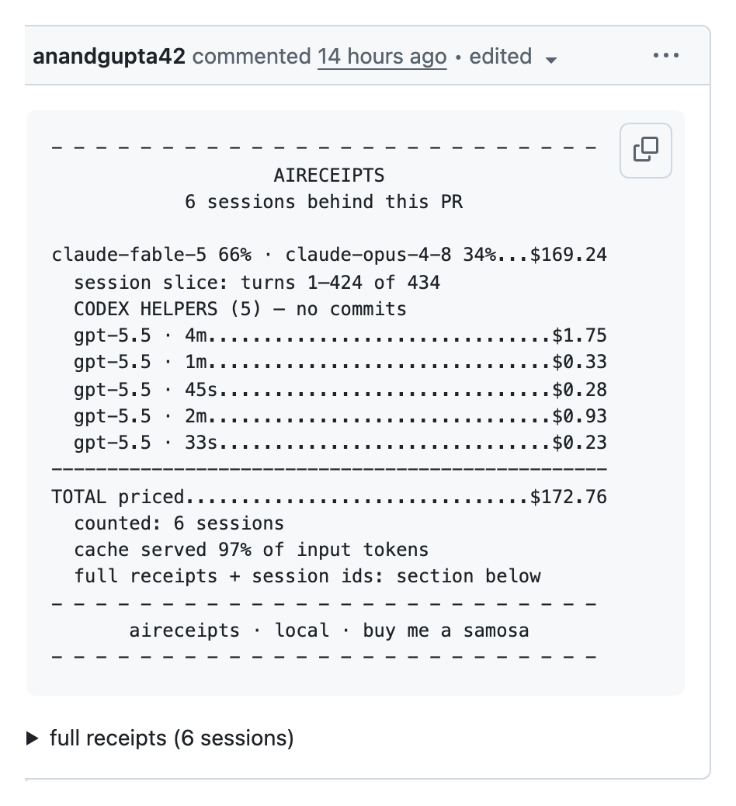

<div align="center">

<picture>
  <source media="(prefers-color-scheme: dark)" srcset="site/brand/wordmark-dark.svg">
  
</picture>

**Your AI coding agent just billed you. Here's the receipt.**

[](https://github.com/anandgupta42/receipts/actions/workflows/ci.yml) [](https://www.npmjs.com/package/aireceipts-cli) [](https://scorecard.dev/viewer/?uri=github.com/anandgupta42/receipts) [](LICENSE)

<a href="https://github.com/anandgupta42/receipts/pull/131#issuecomment-4886722030">
  
</a>

<sub>not a mockup — a receipt comment on a merged PR of this repo, posted by <code>aireceipts pr --post</code>. <a href="https://github.com/anandgupta42/receipts/pull/131#issuecomment-4886722030">Read it live.</a></sub>

</div>

**Why this exists.** AI coding agents spend real money invisibly — you see the diff,
never the bill. aireceipts reads the transcripts your agent already writes to disk and
turns them into receipts: what a session cost, tool by tool; what a PR cost, across
every supported agent session it can attribute; where tokens were wasted. This repo
runs on it: every pull request here carries the receipt of the agent sessions that
built it — the comment above is one ([how](docs/pr-receipts.md)).

- **Local. No accounts, no servers.** Your transcripts and code never leave your
  machine; rendering a receipt makes zero network calls.
- **Never a fabricated dollar.** A `$` renders only from a cited, dated price row;
  unknown models show tokens, never guesses.
- **Deterministic.** Same transcript in, byte-identical receipt out — golden-tested
  on every commit ([what a receipt proves](docs/trust.md)).
- **Telemetry disclosed and killable.** Anonymous, content-free diagnostics, on by
  default and opt-out ([docs/telemetry.md](docs/telemetry.md)).

## Install — four steps, first receipt in under a minute

1. **See a receipt.** `npx aireceipts-cli` — your newest session, no install, no
   account (`npx aireceipts-cli --demo` shows a bundled example if you have no
   sessions yet).
2. **Get your bearings.** `npx aireceipts-cli setup` — found sessions, latest cost,
   week total, and the integrations that fit your machine
   ([guide](docs/guide/01-getting-started.md)).
3. **Make it always-on.** `aireceipts install-hook` ends every Claude Code session
   with a mini-receipt; `aireceipts statusline` puts the live cost in the status bar.
4. **Put receipts on your PRs.** `aireceipts pr --post` posts the receipt — the
   same comment shown above. Generation stays local; a drop-in
   [CI check](docs/adopt/pr-receipt-check-caller.yml) can then verify every PR
   carries one ([guide](docs/pr-receipts.md)).

Prefer a global install: `npm i -g aireceipts-cli`, then the command is `aireceipts`.


<sub>`aireceipts --demo` — the bundled sample session; recorded by
[`site/assets/demo.tape`](site/assets/demo.tape)</sub>

What you get back, as the bytes your terminal prints:

```
- - - - - - - - - - - - - - - - - - - - - - - - -
                    AIRECEIPTS                    
 “Add email format validation to the signup for…” 
 Claude Code · Jun 18 2026 09:30:30 UTC · 10m 30s 
    claude-opus-4-8 87% · claude-sonnet-5 13%     
         cache served 85% of input tokens         

Bash..............................$0.05  (3 calls)
Edit..............................$0.05  (2 calls)
(thinking/reply)..................$0.03  (2 turns)
Write.............................$0.03  (2 calls)
Read...............................$0.02  (1 call)
--------------------------------------------------
TOTAL........................................$0.18
same tokens on claude-haiku-4-5..............$0.04
  (arithmetic, not a prediction)
- - - - - - - - - - - - - - - - - - - - - - - - -
     aireceipts · local · npx aireceipts-cli      
- - - - - - - - - - - - - - - - - - - - - - - - -
```

<div align="center">

<picture>
  <source media="(prefers-color-scheme: dark)" srcset="goldens/svg/claude-code-clean-multi-tool-2-models-dark.svg">
  
</picture>

<sub>the same receipt as <code>--svg</code> renders it — byte-pinned to this repo's golden tests</sub>

</div>

## Usage

| Command | What it does |
|---|---|
| `aireceipts` | Receipt for the newest session (`--list` to pick another) |
| `aireceipts --demo` | See a sample receipt with no sessions of your own — a bundled example, rendered live |
| `aireceipts setup` | First-run report: found sessions, latest cost, week total, integration options — [guide](docs/guide/01-getting-started.md) |
| `aireceipts integrations [target]` | Exact local snippets for Claude Code, Codex, opencode, Cursor, and GitHub — [guide](docs/guide/15-integrations.md) |
| `aireceipts pr --post` | Attach the receipt of the sessions behind a PR as a comment — [guide](docs/pr-receipts.md) |
| `aireceipts pr --post --artifact` | Also publish a durable receipt page, linked from the comment — [how](docs/pr-receipts.md) |
| `aireceipts compare <a> <b>` | Two sessions side by side — models, tools, waste, ratio — [guide](docs/guide/05-compare.md) |
| `aireceipts week` | Trailing-7-day digest: totals, per-agent split, top waste — [guide](docs/guide/06-week.md) |
| `aireceipts --svg -o r.svg` | The receipt as a shareable image, light/dark themes |
| `aireceipts --handoff` | Paste-ready block that tells your *agent* what to do cheaper next time — [guide](docs/guide/09-handoff.md) |
| `aireceipts install-hook` | Consent-gated Claude Code hook: every session ends with a mini-receipt — [guide](docs/guide/03-install-hook.md) |
| `aireceipts statusline` | Live cost line in Claude Code's status bar — [setup](docs/statusline.md) |
| `aireceipts --quota` | Your official rate-limit window state (subscribers) |
| `aireceipts --check-budget` | Exit 1 when your local budget cap is exceeded — advisory, composable |
| `aireceipts --json` / `--csv` | Versioned schema / RFC 4180 rows — [schema](docs/json-schema.md) |

## What you get

- **PR receipts**: every pull request can carry the receipt of the agent sessions that
  built it — totals across leads, builders, and helpers, floors when anything is
  unattributed.
- **A per-tool cost anatomy** of every session: models, cache tiers, tool-by-tool spend.
- **Waste lines, precision-gated**: stuck tool loops and trivial spans a cheaper model
  could run — each priced, each conservative (a false positive fails our CI).
- **An honest cheaper-model line**: "same tokens on X" is arithmetic on your real token
  counts, never a claim that X would have done the job.
- **Exports**: SVG/PNG images, JSON with a versioned schema, CSV.

## The honesty rules

The receipt is only useful if you can trust every character on it. What a receipt
proves — and what it can't: [docs/trust.md](docs/trust.md).

- **No fabricated dollars, ever.** A model without a cited, dated price row renders
  tokens-only — never a guess.
- **Every price is cited.** Each row in `data/prices/` carries the vendor page URL, the
  date observed, and a quoted excerpt. CI checks the citations and their liveness.
- **Comparisons are arithmetic, not predictions.** "Same tokens on X" re-prices the
  identical token counts — it never claims another model would have done the job.
- **Deterministic.** Same transcript in, byte-identical receipt out — golden-tested on
  every commit, 10× under a frozen environment. The receipts on this page are pinned
  to those goldens by CI: this README cannot show output the renderer didn't produce.

Full methodology: `aireceipts --methodology`.

## Supported agents

| Agent | Depth |
|---|---|
| [Claude Code](docs/agents/claude-code.md) | Full: per-turn models, tools, cache tiers |
| [Codex CLI](docs/agents/codex.md) | Full per-turn parsing |
| [Gemini CLI](docs/agents/gemini.md) | Full: per-turn models, tools, cache tokens |
| [Cursor](docs/agents/cursor.md) | Honest degraded mode: session totals only (its logs carry no per-turn usage) |
| [opencode](docs/agents/opencode.md) | Full: per-message models, tools, cache read/write; multi-provider pricing resolves per turn from the model id, and unknown models stay tokens-only |

Model prices move. A daily advisory tripwire cross-checks `data/prices/` against an
independent dataset and opens an issue when they disagree; every table change lands
as a cited price-table PR — watch or star the repo to catch price updates and new
releases.

## Telemetry, disclosed

Anonymous diagnostics and usage signals — error classes, duration buckets, parse-failure signatures, feature enums, and coarse buckets.
Never code, prompts, paths, titles, or dollar amounts. See exactly what a run would
send: `aireceipts --telemetry-show`. Kill it: `AIRECEIPTS_TELEMETRY=off` or
`DO_NOT_TRACK=1`. Schema and rationale: [docs/telemetry.md](docs/telemetry.md).

## Docs

**[User guide](docs/guide/01-getting-started.md)** — get started, every command,
pricing, troubleshooting ([hosted docs](https://anandgupta42.github.io/receipts/docs/) ·
[site](https://anandgupta42.github.io/receipts/)).

[FAQ](docs/faq.md) · [What a receipt proves](docs/trust.md) ·
[PR receipts](docs/pr-receipts.md) · [Integrations](docs/guide/15-integrations.md) ·
[JSON schema](docs/json-schema.md) · [statusline](docs/statusline.md) ·
[telemetry](docs/telemetry.md)

**Related work.** [claude-receipts](https://github.com/chrishutchinson/claude-receipts)
prints a beautiful thermal-receipt souvenir of a Claude Code session (numbers via
[ccusage](https://github.com/ryoppippi/ccusage)); [Infracost](https://github.com/infracost/infracost)
does cost-as-a-PR-comment for Terraform. aireceipts is the bookkeeping sibling:
multi-agent parsing, cited prices, and PR-level attribution with an honesty model.
[ccusage](https://github.com/ryoppippi/ccusage) is the standard for daily and weekly
usage dashboards across coding agents; aireceipts answers a different question — what
a specific session or PR cost, with every number traceable.

## Versioning & stability

Pre-1.0 (`0.x`): **minor** versions may change behavior or output, **patch**
versions are fixes only. The receipt's byte-stability contract (I5) is the
compatibility surface — a change that breaks byte-stability for existing golden
receipts is a **major** bump, and won't happen inside `0.x` minors without a
changelog callout. Every release is tagged, with notes on the
[Releases page](https://github.com/anandgupta42/receipts/releases) and in
[the changelog](docs/CHANGELOG.md).

## Contributing

aireceipts is designed and largely built by AI agents under a spec-driven harness —
adversarially validated specs, mutation-tested money paths, byte-golden outputs, and
PRs that carry the receipt of the session that built them
([how and why](docs/internal/harness.md)). Human PRs are welcome and run the same
gates: see [CONTRIBUTING.md](CONTRIBUTING.md).

## License

Apache-2.0. · [buy me a samosa](https://anandgupta42.github.io/receipts/samosa.html)
